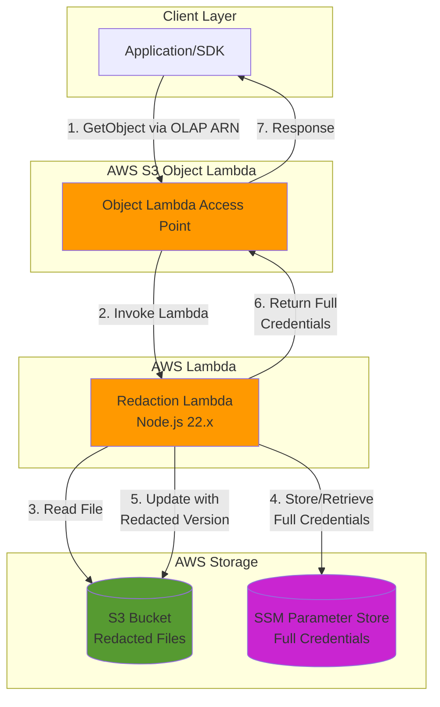

# Redact PII

> Transparent credential redaction system using AWS S3 Object Lambda

## Overview

Redact PII is an AWS-based solution that provides **transparent credential redaction** for files stored in S3. Using S3 Object Lambda, the system automatically intercepts read requests and returns full credentials to authorized applications while storing only redacted versions in S3.

This approach enables:

- ✅ **Zero application changes** - Only update the bucket name/ARN
- ✅ **Backward compatibility** - Direct S3 access returns redacted content
- ✅ **Automatic redaction** - Credentials are redacted on first access
- ✅ **Centralized secret management** - All credentials stored securely in SSM Parameter Store
- ✅ **Complete audit trail** - SSM provides full audit logging

## Architecture



## How It Works

1. **Application requests credentials** from the Object Lambda Access Point ARN
2. **Object Lambda invokes** the redaction Lambda function
3. **Lambda reads** the file from S3 (via S3 Access Point)
4. **Lambda detects** if credentials are redacted or plain text:
   - **If plain text**: Stores full credentials in SSM, writes redacted version to S3
   - **If redacted**: Retrieves full credentials from SSM
5. **Lambda returns** full credentials to the application via Object Lambda
6. **S3 contains** only redacted credentials for security

### Example: First Access

```json
// Original file in S3
{
  "credentials": [{ "clientId": "client-1", "apiKey": "sk-abc123xyz" }],
  "lastUpdated": "2025-10-23T12:00:00Z"
}
```

**After first access via Object Lambda:**

- Application receives full credentials: `"apiKey": "sk-abc123xyz"`
- S3 file is updated: `"apiKey": "****3xyz"` (redacted)
- SSM stores full credential: `/pii/client-1/credentials` → `sk-abc123xyz`

## Project Structure

This is a **yarn workspace monorepo** with the following packages:

```
redact-pii/
├── packages/
│   ├── app/                    # Lambda function and utilities
│   └── infrastructure/         # AWS CDK infrastructure code
├── notebooks/                  # Jupyter notebooks for testing
├── package.json               # Root workspace configuration
└── README.md                  # This file
```

### Packages

#### 📦 [@redact-pii/app](./packages/app/README.md)

Contains the Lambda function implementation and credential management utilities.

**Key Features:**

- Lambda handler for S3 Object Lambda redaction
- Credential storage/retrieval with SSM
- Winston-based structured logging
- TypeScript utilities for credential management

**[→ Read full app documentation](./packages/app/README.md)**

#### 🏗️ [@redact-pii/infrastructure](./packages/infrastructure/README.md)

AWS CDK infrastructure code for deploying the entire system.

**Resources Created:**

- S3 bucket for storing redacted credentials
- S3 Access Point for Lambda access
- S3 Object Lambda Access Point for transparent redaction
- Lambda function (Node.js 22.x runtime)
- SSM parameters for configuration and credentials
- IAM roles and policies

**[→ Read full infrastructure documentation](./packages/infrastructure/README.md)**

## Getting Started

### Prerequisites

- **Node.js** v25+ (specified in `engines` field)
- **Yarn** v4.10.3 (automatic via `packageManager` field)
- **AWS CLI** configured with appropriate credentials
- **AWS Account** with CDK bootstrapped

### Installation

```bash
# Clone the repository
git clone https://github.com/caverac/redact-pii.git
cd redact-pii

# Install dependencies (all workspaces)
yarn install
```

### Quick Deploy

1. **Set environment**:

   ```bash
   export ENVIRONMENT=development
   ```

2. **Deploy infrastructure**:

   ```bash
   yarn workspace @redact-pii/infrastructure cdk deploy
   ```

3. **Note the Object Lambda Access Point ARN** from the deployment outputs

4. **Use in your application**:

   ```python
   import boto3

   s3 = boto3.client('s3')
   response = s3.get_object(
       Bucket='arn:aws:s3-object-lambda:us-east-1:ACCOUNT:accesspoint/pii-object-lambda-ap-development',
       Key='credentials.json'
   )
   credentials = response['Body'].read().decode('utf-8')
   ```

### Development Workflow

```bash
# Lint code
yarn lint

# Fix linting issues
yarn lint:fix

# Deploy infrastructure changes
yarn workspace @redact-pii/infrastructure cdk deploy

# View infrastructure diff
yarn workspace @redact-pii/infrastructure cdk diff

# Clean all node_modules
yarn nuke
```

## Use Cases

### 1. Secure Credential Storage

**Problem**: Hundreds of credential files in S3 with plain-text API keys

**Solution**: Deploy Object Lambda to automatically redact credentials on first access while maintaining access for authorized applications

### 2. Backward Compatibility

**Problem**: Many systems depend on existing S3 structure, can't migrate all at once

**Solution**: Applications only need to change the bucket name to the Object Lambda ARN. Direct S3 access still works (returns redacted content).

### 3. Credential Rotation

**Problem**: Rotating credentials requires updating all S3 files

**Solution**: Update credentials in SSM Parameter Store only. S3 files remain redacted. Object Lambda always returns latest from SSM.

### 4. Audit & Compliance

**Problem**: No visibility into who accesses credentials

**Solution**: SSM Parameter Store provides complete audit trail. CloudWatch logs all Lambda invocations.

## Configuration

### Environment Variables

The system supports two environments:

- **`development`** - Development/staging environment
- **`production`** - Production environment

Set via environment variable:

```bash
export ENVIRONMENT=development
```

### CORS Configuration

Configure allowed origins in `packages/infrastructure/src/utils/cors.ts`:

```typescript
export function getAllowedOrigins(env: string): string[] {
  if (env === 'development') {
    return ['http://localhost:3000']
  }
  if (env === 'production') {
    return ['https://example.com']
  }
  return ['*']
}
```

## Testing

### Python Examples

The `packages/app` directory includes Python examples for testing:

```bash
# Access via Object Lambda (returns full credentials)
python packages/app/examples/get-object-lambda.py

# Access directly from S3 (returns redacted credentials)
python packages/app/examples/get-object-s3.py

# Delete test objects
python packages/app/examples/delete-objects.py
```

### Jupyter Notebook

Interactive testing notebook available at `notebooks/redact-pii.ipynb`:

```bash
jupyter notebook notebooks/redact-pii.ipynb
```

## Security Considerations

### What's Redacted

- API keys are redacted to show only last 4 characters: `****3xyz`
- Full credentials are stored in SSM Parameter Store with encryption at rest
- SSM parameters follow naming convention: `/pii/{clientId}/credentials`

### IAM Permissions Required

**For Lambda Function:**

- `s3:GetObject`, `s3:PutObject` - Read/write to S3 and Access Point
- `s3-object-lambda:WriteGetObjectResponse` - Return transformed objects
- `ssm:GetParameter`, `ssm:PutParameter` - Manage credentials in SSM

**For Applications:**

- `s3-object-lambda:GetObject` - Access via Object Lambda Access Point

### Encryption

- **S3**: Server-side encryption (SSE-S3 by default)
- **SSM**: Encrypted at rest using AWS KMS
- **Lambda**: Environment variables encrypted with AWS-managed keys

## Monitoring & Logging

### CloudWatch Logs

Lambda function logs available at:

```bash
aws logs tail /aws/lambda/redact-pii__redact-lambda --follow
```

### Metrics to Monitor

- **Lambda Invocations** - Number of redaction requests
- **Lambda Errors** - Failed redactions
- **Lambda Duration** - Performance monitoring
- **S3 GetObject Requests** - Access patterns
- **SSM GetParameter Calls** - Credential retrievals

### Sample CloudWatch Insights Query

```sql
fields @timestamp, @message
| filter @message like /ERROR/
| sort @timestamp desc
| limit 20
```

## Cost Estimation

For a system processing **1 million requests per month**:

| Service             | Cost            | Details               |
| ------------------- | --------------- | --------------------- |
| S3 Object Lambda    | ~$500           | $0.0005 per request   |
| Lambda              | ~$20            | 128 MB, 25s timeout   |
| S3 Storage          | ~$5             | 1000 credential files |
| SSM Parameter Store | Free            | < 10,000 parameters   |
| Data Transfer       | Variable        | Depends on file sizes |
| **Total**           | **~$525/month** |                       |

**Cost optimization tips:**

- Use Lambda caching to reduce SSM calls
- Optimize Lambda memory/timeout settings
- Use S3 Intelligent-Tiering for infrequently accessed files

## Roadmap & RFC

An RFC (Request for Comments) document is available detailing the full implementation plan for organizational rollout:

**[→ Read the RFC](./packages/app/rfc.md)**

The RFC covers:

- **Problem statement** - Credentials in S3, complex dependency graph
- **Proposed solution** - S3 Object Lambda implementation
- **Timeline** - 9-week rollout plan (POC complete)
- **Migration strategy** - Consumer updates and rollback procedures
- **Risk mitigation** - Handling unknown dependencies

## Cleanup

### Remove All Resources

```bash
# Destroy CDK stack
ENVIRONMENT=development yarn workspace @redact-pii/infrastructure cdk destroy

# Delete S3 objects
aws s3 rm s3://pii-bucket-development --recursive

# Delete SSM parameters
aws ssm delete-parameters --names $(aws ssm describe-parameters \
  --query 'Parameters[?starts_with(Name, `/pii/`)].Name' \
  --output text)
```

## Troubleshooting

### Common Issues

**Error: "Cannot deploy to local environment"**

- Set `ENVIRONMENT` to `development` or `production`

**Error: "esbuild not found"**

- Ensure root `package.json` has `"esbuild": "esbuild"` script

**Lambda signature mismatch errors**

- Verify Lambda has correct IAM permissions
- Check S3 Access Point configuration

**Object Lambda not returning full credentials**

- Check Lambda CloudWatch logs for errors
- Verify SSM parameters exist
- Test Lambda function independently

**[→ More troubleshooting in infrastructure docs](./packages/infrastructure/README.md#troubleshooting)**

## Contributing

This is an open-source project. Contributions are welcome!

### Development Setup

1. Fork the repository
2. Create a feature branch
3. Make your changes
4. Run linting: `yarn lint:fix`
5. Test your changes
6. Submit a pull request

### Code Style

- **TypeScript** with strict type checking
- **ESLint** + **Prettier** for code formatting
- **JSDoc** comments for all public functions
- **Conventional Commits** for commit messages

## Resources

### Documentation

- [Application Package](./packages/app/README.md)
- [Infrastructure Package](./packages/infrastructure/README.md)
- [Implementation RFC](./packages/app/rfc.md)

### AWS Documentation

- [S3 Object Lambda](https://docs.aws.amazon.com/AmazonS3/latest/userguide/transforming-objects.html)
- [AWS CDK](https://docs.aws.amazon.com/cdk/)
- [AWS Lambda](https://docs.aws.amazon.com/lambda/)
- [SSM Parameter Store](https://docs.aws.amazon.com/systems-manager/latest/userguide/systems-manager-parameter-store.html)

### Related Projects

- [AWS S3 Object Lambda Examples](https://github.com/aws-samples/amazon-s3-object-lambda-default-configuration)
- [AWS CDK Examples](https://github.com/aws-samples/aws-cdk-examples)

## License

Apache-2.0

## Author

**caverac@gmail.com**

---

**Questions or Issues?** Open an issue on GitHub or contact the author.
