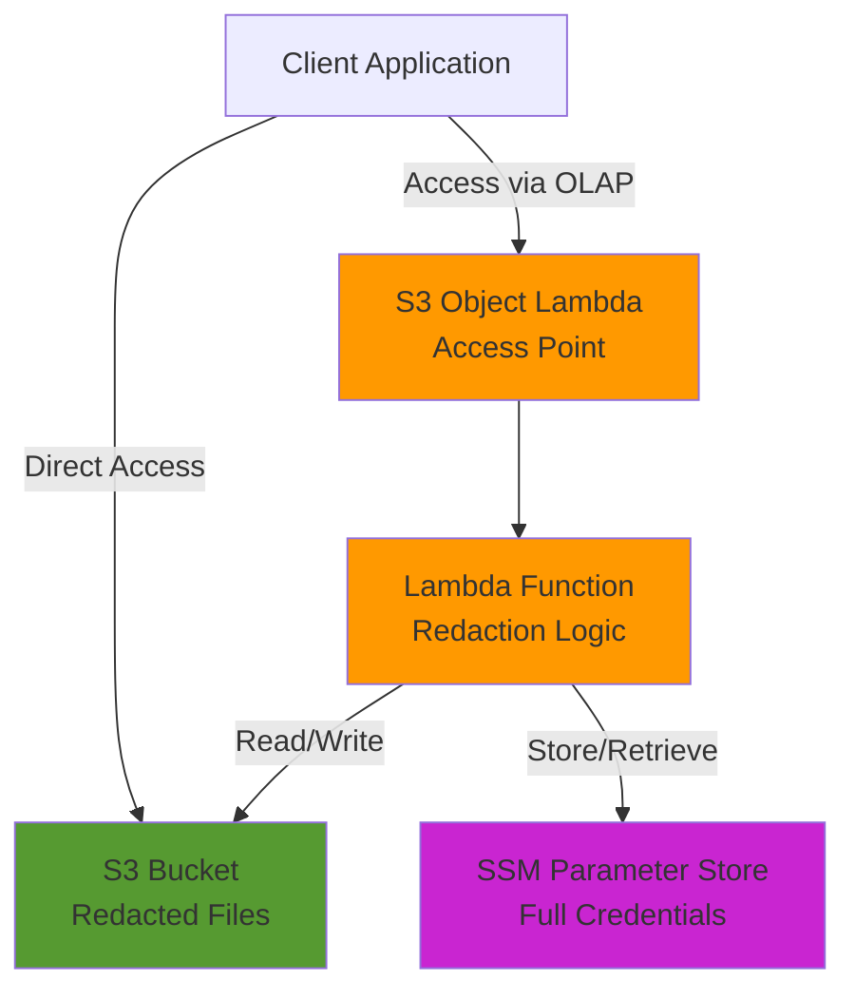

# Redact PII

An AWS Lambda-based solution for automatically redacting Personally Identifiable Information (PII) and sensitive credentials from S3 objects using S3 Object Lambda.

## Overview

This application provides transparent credential management by:

1. **Automatic Redaction**: When a file containing credentials is accessed through the S3 Object Lambda Access Point, sensitive API keys are automatically redacted in the S3 file
2. **Secure Storage**: Full (unredacted) credentials are securely stored in AWS Systems Manager (SSM) Parameter Store
3. **Transparent Access**: Applications can access full credentials through the Object Lambda Access Point while the actual S3 file only contains redacted values
4. **Smart Caching**: If a file is already redacted, the Lambda fetches the full credentials from SSM without re-processing

This ensures that sensitive credential data is never persisted in S3 files in plain text, while applications can still access the full credentials seamlessly through AWS services.

## Architecture



## How It Works

### First Access (Unredacted File)

1. File in S3 contains plain text credentials
2. User accesses file through Object Lambda Access Point
3. Lambda detects unredacted credentials
4. Lambda stores full credentials in SSM Parameter Store
5. Lambda writes redacted version back to S3
6. Lambda returns full credentials to user

### Subsequent Access (Redacted File)

1. File in S3 contains redacted credentials (`****XXXX`)
2. User accesses file through Object Lambda Access Point
3. Lambda detects redacted credentials
4. Lambda fetches full credentials from SSM
5. Lambda returns full credentials to user

## Usage Examples

### Python - boto3

#### Access Full Credentials (via Object Lambda)

```python
import boto3

s3 = boto3.client('s3')
sts = boto3.client('sts')

# Get account info
account_id = sts.get_caller_identity()['Account']
region = 'us-east-1'

# Object Lambda Access Point ARN
olap_arn = f'arn:aws:s3-object-lambda:{region}:{account_id}:accesspoint/pii-object-lambda-ap-development'

# Access through Object Lambda - returns FULL credentials
response = s3.get_object(
    Bucket=olap_arn,
    Key="credentials.json"
)

content = response['Body'].read().decode('utf-8')
print(content)
# Output: {"credentials": [{"clientId": "client-1", "apiKey": "sk_live_abc123xyz"}]}
```

#### Access Redacted File (direct S3)

```python
import boto3

s3 = boto3.client('s3')

# Direct bucket access - returns REDACTED credentials
response = s3.get_object(
    Bucket="pii-bucket-development",
    Key="credentials.json"
)

content = response['Body'].read().decode('utf-8')
print(content)
# Output: {"credentials": [{"clientId": "client-1", "apiKey": "****3xyz"}]}
```

## Credential Format

### Credentials File Structure

```json
{
  "credentials": [
    {
      "clientId": "client-1",
      "apiKey": "sk_live_abc123xyz"
    },
    {
      "clientId": "client-2", 
      "apiKey": "pk_test_def456uvw"
    }
  ],
  "lastUpdated": "2025-10-23T12:00:00Z"
}
```

### Redacted Format

API keys are redacted by replacing all characters except the last 4 with asterisks:

- Original: `sk_live_abc123xyz`
- Redacted: `****3xyz`

### SSM Parameter Store

Full credentials are stored in SSM Parameter Store with the following naming convention:

```
/pii/{clientId}/credentials
```

Example:
- Parameter Name: `/pii/client-1/credentials`
- Parameter Value: `{"clientId":"client-1","apiKey":"sk_live_abc123xyz"}`

## Security Benefits

1. **No Plain Text Storage**: Credentials are never stored in plain text in S3
2. **Audit Trail**: SSM Parameter Store provides audit logging
3. **Access Control**: IAM policies control access to both S3 and SSM
4. **Encryption**: SSM parameters can be encrypted with KMS
5. **Transparent**: Applications don't need to change - they access through Object Lambda

## Infrastructure

The application deploys:

- **S3 Bucket**: Stores redacted credential files
- **S3 Access Point**: Regular access point for the bucket
- **S3 Object Lambda Access Point**: Provides transparent credential redaction
- **Lambda Function**: Handles redaction logic and SSM integration
- **SSM Parameter Store**: Securely stores full credentials

## Environment Variables

- `BUCKET_NAME`: Name of the S3 bucket containing credential files
- `ENVIRONMENT`: Deployment environment (development/production)
- `LOG_LEVEL`: Logging level (info/debug/warn/error)

## Development

### Build

```bash
yarn workspace @redact-pii/app build
```

### Test

```bash
yarn workspace @redact-pii/app test
```

### Deploy

```bash
yarn workspace @redact-pii/infrastructure cdk deploy
```

## License

Apache-2.0
