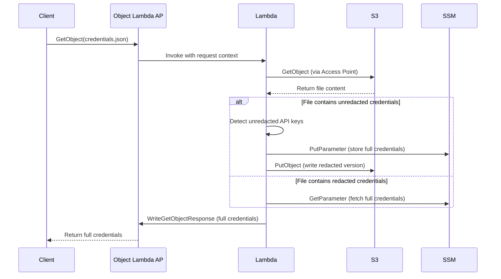

# Infrastructure Package

AWS CDK infrastructure for the PII Redaction System using S3 Object Lambda.

## Table of Contents

- [Overview](#overview)
- [Prerequisites](#prerequisites)
- [Getting Started](#getting-started)
- [CDK Commands](#cdk-commands)
- [Stacks](#stacks)
- [Architecture](#architecture)
- [Configuration](#configuration)
- [Deployment Workflow](#deployment-workflow)
- [Cleanup](#cleanup)

## Overview

This package contains the AWS CDK infrastructure code for deploying a transparent credential redaction system. It uses S3 Object Lambda to automatically redact sensitive information from files stored in S3 while maintaining backward compatibility with existing systems.

## Prerequisites

Before deploying, ensure you have:

1. **AWS CLI** configured with appropriate credentials
   ```bash
   aws configure
   ```

2. **Node.js** (v18 or higher) and Yarn installed
   ```bash
   node --version  # Should be v18+
   yarn --version
   ```

3. **AWS CDK** bootstrapped in your target account/region
   ```bash
   # Bootstrap your AWS environment (one-time setup per account/region)
   yarn workspace @redact-pii/infrastructure cdk bootstrap
   ```

4. **Environment variables** set:
   ```bash
   export ENVIRONMENT=development  # or 'production'
   ```

## Getting Started

### Install Dependencies

From the project root:

```bash
# Install all workspace dependencies
yarn install
```

### Verify Setup

```bash
# Check CDK version
yarn workspace @redact-pii/infrastructure cdk --version

# Synthesize CloudFormation template (no deployment)
yarn workspace @redact-pii/infrastructure cdk synth
```

## CDK Commands

All CDK commands should be run from the **project root** using yarn workspace:

### Deploy Stack

```bash
# Deploy to development environment
ENVIRONMENT=development yarn workspace @redact-pii/infrastructure cdk deploy

# Deploy to production environment
ENVIRONMENT=production yarn workspace @redact-pii/infrastructure cdk deploy

# Deploy with automatic approval (no confirmation prompt)
ENVIRONMENT=development yarn workspace @redact-pii/infrastructure cdk deploy --require-approval never
```

### Synthesize CloudFormation

Generate CloudFormation template without deploying:

```bash
ENVIRONMENT=development yarn workspace @redact-pii/infrastructure cdk synth
```

Output will be in `cdk.out/RedactPIIS3Stack.template.json`

### View Differences

Compare deployed stack with current code:

```bash
ENVIRONMENT=development yarn workspace @redact-pii/infrastructure cdk diff
```

### List Stacks

```bash
ENVIRONMENT=development yarn workspace @redact-pii/infrastructure cdk ls
```

### Destroy Stack

Remove all deployed resources:

```bash
ENVIRONMENT=development yarn workspace @redact-pii/infrastructure cdk destroy
```

### Watch Mode

Continuously monitor for changes and auto-deploy:

```bash
ENVIRONMENT=development yarn workspace @redact-pii/infrastructure cdk watch
```

### Additional Options

```bash
# Deploy with specific profile
AWS_PROFILE=my-profile ENVIRONMENT=development yarn workspace @redact-pii/infrastructure cdk deploy

# Deploy to specific region
AWS_REGION=us-west-2 ENVIRONMENT=development yarn workspace @redact-pii/infrastructure cdk deploy

# View context values
yarn workspace @redact-pii/infrastructure cdk context

# Generate deployment outputs
ENVIRONMENT=development yarn workspace @redact-pii/infrastructure cdk deploy --outputs-file outputs.json
```

## Stacks

This infrastructure package deploys a single CDK stack:

### RedactPIIS3Stack

**Stack Name**: `RedactPIIS3Stack`  
**Purpose**: Deploys S3 Object Lambda infrastructure for transparent credential redaction  
**Environment-Specific**: Yes (resources are tagged with `ENVIRONMENT`)

## Architecture

The `RedactPIIS3Stack` creates the following AWS resources:

```mermaid
graph TB
    subgraph "Client Applications"
        App[Application/SDK]
    end
    
    subgraph "AWS Account"
        subgraph "S3 Object Lambda"
            OLAP[Object Lambda Access Point<br/>pii-object-lambda-ap-{env}]
        end
        
        subgraph "S3 Access Points"
            SAP[S3 Access Point<br/>pii-access-point-{env}]
        end
        
        subgraph "Lambda"
            Lambda[Redaction Lambda<br/>redact-pii__redact-lambda]
        end
        
        subgraph "S3"
            Bucket[S3 Bucket<br/>pii-bucket-{env}]
        end
        
        subgraph "SSM Parameter Store"
            SSM[Parameters<br/>/pii/clientId/credentials]
            SSMBucket[/pii/s3/bucket-arn<br/>/pii/s3/bucket-name]
        end
    end
    
    App -->|GetObject via OLAP ARN| OLAP
    OLAP -->|Invokes on GetObject| Lambda
    Lambda -->|Reads from| SAP
    SAP -->|Accesses| Bucket
    Lambda -->|Stores/Retrieves Credentials| SSM
    Lambda -->|Updates Redacted File| Bucket
    Lambda -->|Returns Full Credentials| OLAP
    OLAP -->|Returns to Client| App
    
    style OLAP fill:#ff9900
    style Lambda fill:#ff9900
    style Bucket fill:#569a31
    style SSM fill:#c925d1
```

### Resource Details

#### 1. S3 Bucket

**Resource**: `pii-bucket-{environment}`

**Purpose**: Stores credential files (redacted after first access)

**Configuration**:
- CORS enabled for GET and PUT operations
- Removal policy: `DESTROY` (deleted when stack is destroyed)
- Allowed origins: Configured per environment

**Outputs**:
- Bucket ARN stored in SSM: `/pii/s3/bucket-arn`
- Bucket name stored in SSM: `/pii/s3/bucket-name`

#### 2. S3 Access Point

**Resource**: `pii-access-point-{environment}`

**Purpose**: Provides access to the S3 bucket for the Object Lambda function

**Configuration**:
- Linked to the S3 bucket
- Used as the supporting access point for Object Lambda

#### 3. Lambda Function

**Resource**: `redact-pii__redact-lambda`

**Purpose**: Handles credential redaction and SSM integration

**Configuration**:
- Runtime: Node.js 22.x
- Memory: 128 MB
- Timeout: 25 seconds
- Entry point: `packages/app/src/lambdas/redact/lambda_handler.ts`

**Environment Variables**:
- `ENVIRONMENT`: Deployment environment (development/production)
- `BUCKET_NAME`: Name of the S3 bucket

**IAM Permissions**:
- `s3:GetObject`, `s3:PutObject` - Read/write to S3 bucket and access point
- `s3-object-lambda:WriteGetObjectResponse` - Return transformed objects
- `ssm:GetParameter`, `ssm:GetParameters`, `ssm:PutParameter` - Store/retrieve credentials from SSM

**Lambda Workflow**:



#### 4. S3 Object Lambda Access Point

**Resource**: `pii-object-lambda-ap-{environment}`

**Purpose**: Intercepts S3 GetObject requests and transforms responses via Lambda

**Configuration**:
- Supporting Access Point: Links to the S3 Access Point
- Transformation: Applied to `GetObject` operations
- Lambda Function: Executes the redaction Lambda

**Usage**:
```python
# Access via Object Lambda (returns full credentials)
import boto3

s3 = boto3.client('s3')
response = s3.get_object(
    Bucket='arn:aws:s3-object-lambda:us-east-1:123456789:accesspoint/pii-object-lambda-ap-development',
    Key='credentials.json'
)
```

#### 5. SSM Parameters

**Resources**:
- `/pii/s3/bucket-arn` - S3 bucket ARN
- `/pii/s3/bucket-name` - S3 bucket name
- `/pii/{clientId}/credentials` - Stored credentials (created by Lambda)

**Purpose**: Store bucket metadata and secure credentials

## Configuration

### Environment Variables

The stack requires the `ENVIRONMENT` environment variable:

```bash
export ENVIRONMENT=development  # Options: 'development' or 'production'
```

**Note**: The `local` environment is not supported for deployment.

### CDK Context

Additional CDK configuration is in `cdk.json`:
- Feature flags for CDK behavior
- File watching patterns
- Synthesis settings

## Deployment Workflow

### First-Time Deployment

1. **Set environment**:
   ```bash
   export ENVIRONMENT=development
   ```

2. **Review changes**:
   ```bash
   yarn workspace @redact-pii/infrastructure cdk diff
   ```

3. **Deploy stack**:
   ```bash
   yarn workspace @redact-pii/infrastructure cdk deploy
   ```

4. **Note the outputs**:
   - S3 bucket name
   - Object Lambda Access Point ARN
   - Lambda function name

### Updating Infrastructure

1. **Modify code** in `src/lib/s3.stack.ts` or related files

2. **View changes**:
   ```bash
   ENVIRONMENT=development yarn workspace @redact-pii/infrastructure cdk diff
   ```

3. **Deploy updates**:
   ```bash
   ENVIRONMENT=development yarn workspace @redact-pii/infrastructure cdk deploy
   ```

### Testing After Deployment

1. **Upload a test file**:
   ```bash
   aws s3 cp test-credentials.json s3://pii-bucket-development/
   ```

2. **Access via Object Lambda**:
   ```python
   import boto3
   
   s3 = boto3.client('s3')
   
   # Get Object Lambda ARN from AWS Console or deployment outputs
   olap_arn = 'arn:aws:s3-object-lambda:us-east-1:123456789:accesspoint/pii-object-lambda-ap-development'
   
   response = s3.get_object(Bucket=olap_arn, Key='test-credentials.json')
   content = response['Body'].read().decode('utf-8')
   print(content)  # Should contain full credentials
   ```

3. **Verify redaction in S3**:
   ```bash
   aws s3 cp s3://pii-bucket-development/test-credentials.json -
   # Should show redacted credentials (****XXXX)
   ```

## Cleanup

### Remove All Resources

```bash
ENVIRONMENT=development yarn workspace @redact-pii/infrastructure cdk destroy
```

### Manual Cleanup

If `cdk destroy` fails, you may need to manually delete:

1. **S3 Bucket Objects**:
   ```bash
   aws s3 rm s3://pii-bucket-development --recursive
   ```

2. **SSM Parameters**:
   ```bash
   aws ssm delete-parameters --names $(aws ssm describe-parameters --query 'Parameters[?starts_with(Name, `/pii/`)].Name' --output text)
   ```

3. **CloudFormation Stack**:
   ```bash
   aws cloudformation delete-stack --stack-name RedactPIIS3Stack
   ```

## Troubleshooting

### Error: "Cannot deploy to local environment"

**Solution**: Set `ENVIRONMENT` to `development` or `production`:
```bash
export ENVIRONMENT=development
```

### Error: "esbuild not found"

**Solution**: Ensure the root `package.json` has the esbuild script:
```json
{
  "scripts": {
    "esbuild": "esbuild"
  }
}
```

### Error: "Stack already exists"

**Solution**: Either update the existing stack or destroy it first:
```bash
ENVIRONMENT=development yarn workspace @redact-pii/infrastructure cdk destroy
```

### Lambda Function Errors

**View logs**:
```bash
aws logs tail /aws/lambda/redact-pii__redact-lambda --follow
```

**Check IAM permissions**:
- Ensure Lambda has access to S3 access point
- Verify SSM parameter permissions

### Object Lambda Not Working

**Verify resources**:
1. Check Object Lambda Access Point exists in AWS Console
2. Verify Lambda function is attached
3. Test Lambda function independently
4. Check CloudWatch Logs for errors

## Additional Resources

- [AWS CDK Documentation](https://docs.aws.amazon.com/cdk/)
- [S3 Object Lambda Documentation](https://docs.aws.amazon.com/AmazonS3/latest/userguide/transforming-objects.html)
- [CDK TypeScript API Reference](https://docs.aws.amazon.com/cdk/api/v2/docs/aws-construct-library.html)
- [Application README](../app/README.md) - For Lambda function implementation details

## License

Apache-2.0
